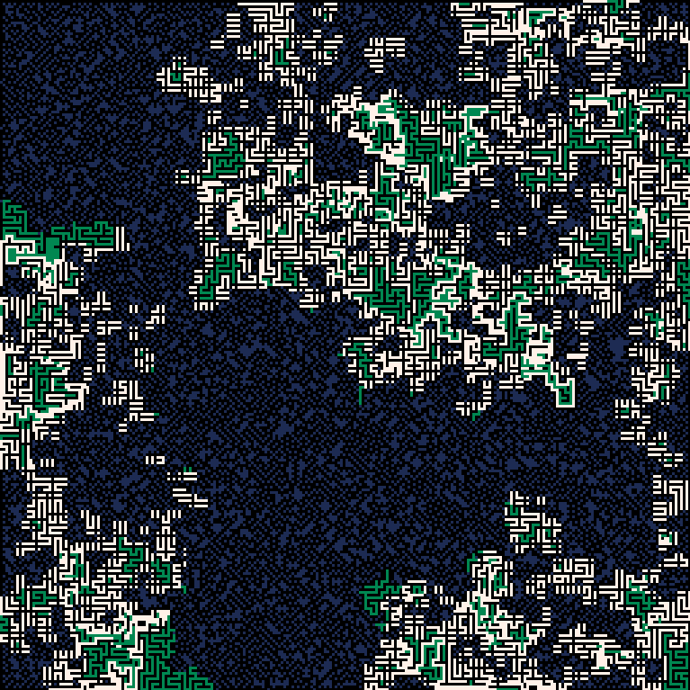

# pattern-match-2d.js

An algorithm for fast 2D pattern-matching with wildcards, with a [demo](https://kaya3.github.io/pattern-match-2d/) app inspired by [MarkovJunior](https://github.com/mxgmn/MarkovJunior) (by Maxim Gumin). 

The algorithm uses a [DFA](https://en.wikipedia.org/wiki/Deterministic_finite_automaton) to match individual rows of patterns in the rows of the grid, then another DFA to match the whole patterns by recognising vertical sequences of row matches. Scanning a rectangular area of the grid takes O((*w*&nbsp;+&nbsp;*a*)(*h*&nbsp;+&nbsp;*b*)&nbsp;+&nbsp;*m*) where *w*, *h* are the width and height of the area, *a*, *b* are the maximum width and height of any pattern, and *m* is the the number of matches which were either made or broken in the scanned area.
